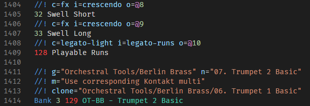

# Change Log

All notable changes to the "reabank-syntax-highlighting" extension will be documented in this file.

## 1.1.0

- Added highlighting for illegal MIDI bytes out of range (0-127).  

- Added `fileTypes` key to grammar so that the grammar may be used in any other compatible editor.

## 1.0.0

Initial release of reabank-syntax-highlighting.

