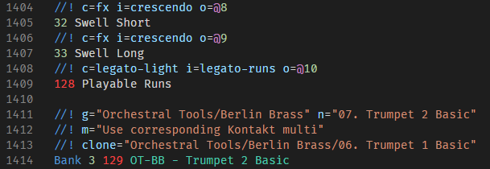

# reabank-syntax-highlighting

Provides syntax highlighting support for [Reaper](https://reaper.fm) Reabank files, with additional support for [Reaticulate](https://reaticulate.com) annotations.

## Release Notes

### 1.1.0

- Added highlighting for illegal MIDI bytes out of range (0-127).  

- Added `fileTypes` key to grammar so that the grammar may be used in any other compatible editor.

### 1.0.0

Initial release of reabank-syntax-highlighting.
